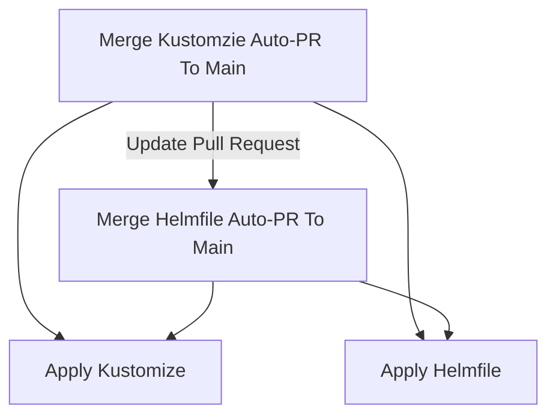

# Interim Release Process With Helmfile and Kustomize

## Context

While migrating from Kustomize to Helmfile, we will need to modify our release process to ensure that both sides get released.

## Procedure

The PR Bot now creates two separate pull requests. One for Kustomize and one for Helm. The Ops Lead must now take additional steps to merge both.

Each merge to main from these Auto-PRs will run BOTH kustomize and helmfile github actions even though they won't be doing anything to the non-affected sides (I.e. Kustomize release will run helmfile apply but there will be no changes)

### Detailed Steps

1. Merge the Kustomize Auto-PR as normal
2. The github following github actions will run. Make sure they complete successfully
    [Merge To Main Production](https://github.com/cds-snc/notification-manifests/actions/workflows/merge_to_main_production.yaml)
    [Helmfile Apply Production](https://github.com/cds-snc/notification-manifests/actions/workflows/helmfile_production_apply.yaml)
3. Once the above actions are completed update the Helmfile PR by clicking the "Update Branch" button
4. Merge the Helmfile PR to main and verify that the two github actions complete successfully.
    [Merge To Main Production](https://github.com/cds-snc/notification-manifests/actions/workflows/merge_to_main_production.yaml)
    [Helmfile Apply Production](https://github.com/cds-snc/notification-manifests/actions/workflows/helmfile_production_apply.yaml)

